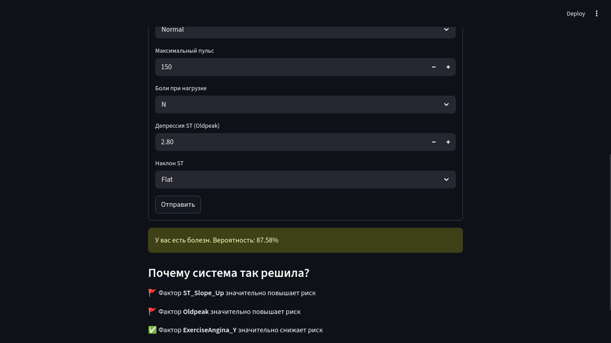
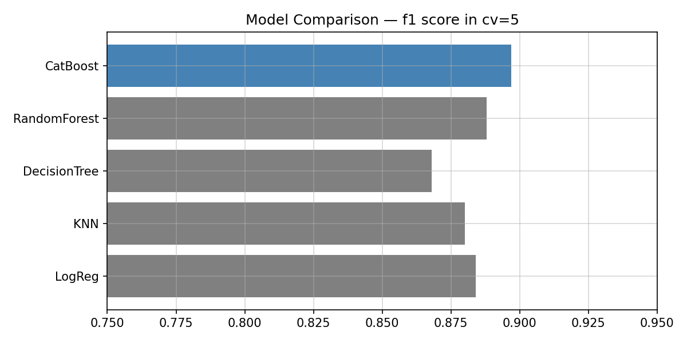

# Heart Disease Prediction

A machine learning project for predicting the risk of heart disease using clinical and physiological data. The application provides predictions with explainability features powered by SHAP (SHapley Additive exPlanations) to help understand which factors contribute most to the prediction.

## 🚀 Quick Start

### Prerequisites
- Python 3.8+

### 1. Clone and Install
```bash
git clone https://github.com/Zhanali0663/Heart-failure-prediction
cd Heart-failure-prediction/
python3 -m venv .venv
source .venv/bin/activate
pip install -r requirements.txt
```

### 2. Run the Web App
```bash
uvicorn api.fastapi:app &
cd ui
streamlit run app.py
```

Open your browser at `http://localhost:8501` and start predicting!

---

## ✨ Features

- **Multiple ML Models**: Trained and compared LogisticRegression, KNeighborsClassifier, DecisionTreeClassifier, RandomForestClassifier, and CatBoostClassifier
- **Hyperparameter selection**: Using GridSearchCV to find optimal parameters for each model
- **CatBoost Model**: Uses the best-performing CatBoost model for predictions
- **Feature Engineering**: Categorical encoding, scaling, and missing value imputation
- **Explainability**: SHAP values to identify top contributing factors for each prediction
- **REST API**: FastAPI endpoint for programmatic access
- **Web UI**: Streamlit interface for easy user interaction

## 📖 Documentation

### Project Overview

This project consists of three main components:

1. **Model Training** (`notebooks/model_training.ipynb`) - Data preprocessing, feature engineering, and model training
2. **FastAPI Backend** (`api/fastapi.py`) - REST API for serving predictions
3. **Streamlit UI** (`ui/app.py`) - Web interface for user interaction



### Project Structure

```
prodaction/
├── README.md
├── photos/
│   ├── image.png
│   └── model_comparison.png
├── data/
│   └── heart.csv
├── models/
│   ├── catboost.cbm
│   └── scaler.joblib
├── notebooks/
│   └── model_training.ipynb
├── api/
│   └── fastapi.py
└── ui/
    └── app.py
```

## 📊 Dataset

The model is trained on the [Heart Failure Prediction Dataset](https://www.kaggle.com/datasets/fedesoriano/heart-failure-prediction/) from Kaggle.

| Feature | Type | Range | Description |
|---------|------|-------|-------------|
| Age | Integer | 18-110 | Patient's age |
| Sex | Categorical | M, F | Gender |
| ChestPainType | Categorical | ASY, ATA, NAP, TA | Type of chest pain |
| RestingBP | Integer | 80-240 | Resting blood pressure (mmHg) |
| Cholesterol | Integer | 80-500 | Cholesterol level (mg/dl) |
| FastingBS | Binary | 0, 1 | Fasting blood sugar > 120 |
| RestingECG | Categorical | Normal, ST, LVH | Resting ECG results |
| MaxHR | Integer | 40-220 | Maximum heart rate (bpm) |
| ExerciseAngina | Binary | Y, N | Exercise-induced angina |
| Oldpeak | Float | 0-6 | ST depression by exercise |
| ST_Slope | Categorical | Up, Flat, Down | ST segment slope |


## 📈 Model Performance




The CatBoost model was trained with the following hyperparameters:
- **iterations**: 145
- **depth**: 8
- **learning_rate**: 0.1
- **l2_leaf_reg**: 5
- **border_count**: 128

Average metrics across 10 folds:
- **Accuracy**: ~89.4%
- **Precision**: ~90%
- **Recall**: ~91%
- **F1-Score**: ~90.4%

## 🛠️ Technologies Used

- **Data Processing**: Pandas, NumPy
- **Visualization**: Matplotlib, Seaborn
- **Machine Learning**: Scikit-learn, CatBoost
- **Model Explainability**: SHAP
- **API Framework**: FastAPI
- **Web Framework**: Streamlit
- **Model Serialization**: Joblib
